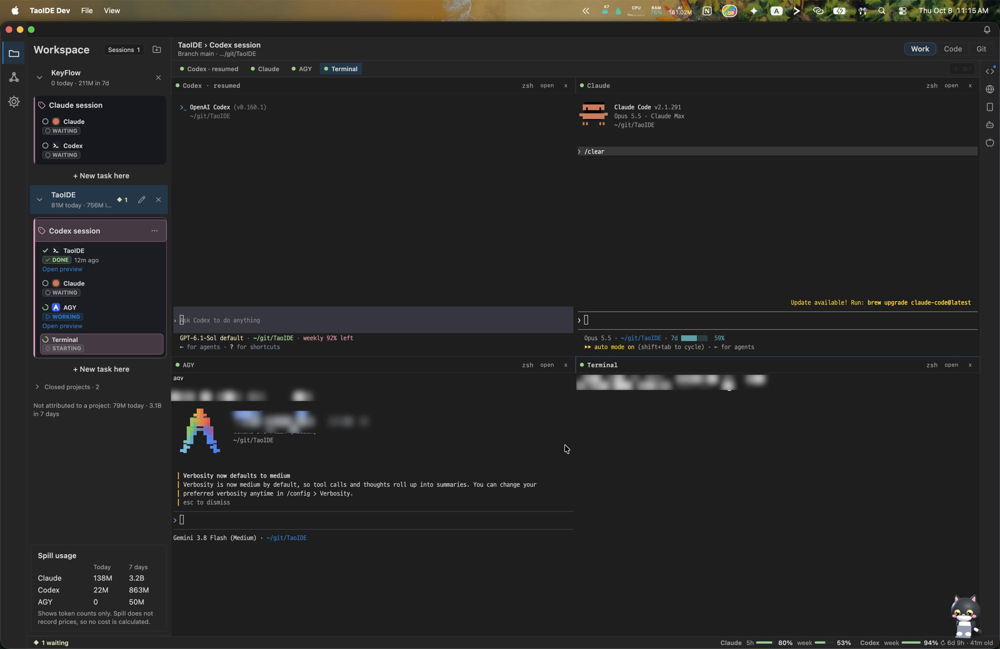
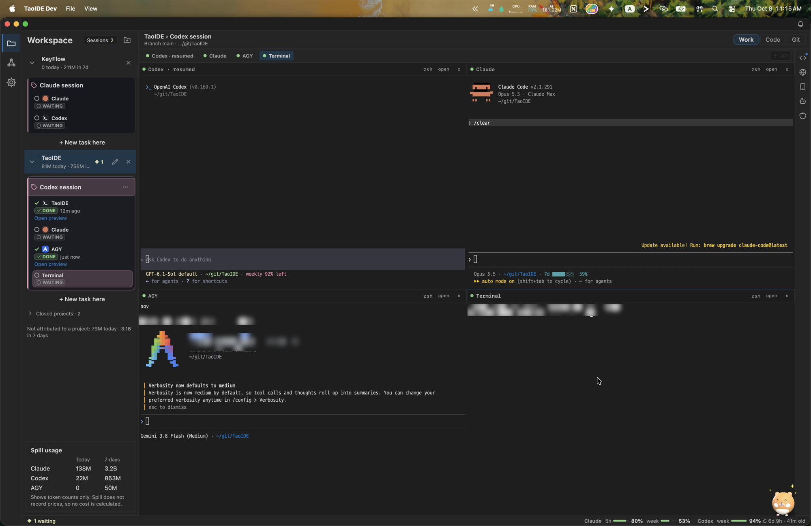

# Tao

[한국어](#한국어) · [English](#english)

---

## 한국어

Tao는 여러 AI 코딩 에이전트를 한 화면에서 돌리고 지켜보는 macOS 데스크톱 워크벤치입니다.
**프로젝트 → Task → 결과 → 승인** 흐름을 기본으로, 에이전트마다 진짜 터미널(PTY)을 열어 줍니다.

### 무엇을 할 수 있나요

- **에이전트를 나란히** — Claude Code, Codex, AGY(Antigravity), 일반 셸을 한 Task 안에서 분할 화면으로 실행합니다.
- **누가 무엇을 하는지 한눈에** — 사이드바의 세션마다 지금 상태를 보여 줍니다: 작업 중, 답을 기다림, 완료(몇 분 전), 대기, 종료, 실패.
- **앱을 꺼도 터미널은 계속** — 터미널은 Tao와 분리된 호스트에서 돌아서, Tao를 닫았다 열어도 실행 중이던 에이전트에 그대로 다시 붙습니다.
- **자기 대화로 이어하기** — 각 터미널은 자기 에이전트 대화만 이어 갑니다. 같은 폴더를 쓰는 다른 Task의 대화를 가져오지 않습니다.
- **알림** — 에이전트가 끝나거나 답을 기다리면 화면 위를 떠다니는 고양이(또는 햄스터)가 알려 주고, 창 오른쪽 위 벨에 기록이 쌓입니다.
- **사용량** — Spill이 설치되어 있으면 에이전트별 토큰 사용량과 남은 한도를 보여 줍니다.
- **결과 확인** — Task 옆에서 바뀐 코드(Code), Git 기록과 변경(Git), 웹/Android 미리보기를 바로 열어 봅니다.

### 설치

1. [Releases](../../releases/latest)에서 `Tao-<버전>.dmg`를 받습니다.
2. DMG를 열고 `Tao`를 `응용 프로그램` 폴더로 끌어다 놓습니다.
3. Apple 공증을 받은 앱이라 바로 열립니다.

에이전트 CLI(`claude`, `codex`, `agy`)는 따로 설치해 두어야 합니다. Tao는 설치된 CLI를 터미널에서 실행할 뿐입니다.

### 업데이트

Tao는 실행 직후와 6시간마다 이 저장소의 최신 릴리즈를 확인합니다. 새 버전이 있으면 백그라운드에서 받아
SHA-256, 서명, 개발자(Team ID), 번들 ID, 버전, Gatekeeper 승인을 확인한 뒤 **재시작하여 업데이트**를 띄웁니다.
재시작해도 터미널은 계속 돌고, 새 버전이 다시 붙어 작업 화면을 그대로 복원합니다.

이 저장소가 비공개인 동안에는 GitHub 로그인이 필요합니다: `gh auth login` 또는 `GH_TOKEN`/`GITHUB_TOKEN`.

---

## English

Tao is a macOS desktop workbench for running and watching several AI coding agents in one place.
It is built around **Project → Task → Result → Approval**, and gives every agent a real terminal (PTY).

### What it does

- **Agents side by side** — run Claude Code, Codex, AGY (Antigravity) and a plain shell in split panes inside one Task.
- **See who is doing what** — each session in the sidebar shows one state: working, needs an answer, done (with how long ago), waiting, ended or failed.
- **Terminals outlive the app** — terminals run in a host separate from Tao, so closing and reopening Tao reattaches to the agents that were running.
- **Resume the right conversation** — every terminal resumes its own agent conversation, never another Task's conversation in the same folder.
- **Notifications** — when an agent finishes or waits for you, a cat (or a hamster) floating over your desktop tells you, and the bell at the top right of the window keeps the history.
- **Usage** — with Spill installed, Tao shows token usage per agent and the limits left.
- **Check the result** — open the changed code (Code), Git history and changes (Git), and web/Android previews right next to the Task.

### Install

1. Download `Tao-<version>.dmg` from [Releases](../../releases/latest).
2. Open the DMG and drag `Tao` into `Applications`.
3. The app is notarized by Apple, so it opens without warnings.

Install the agent CLIs (`claude`, `codex`, `agy`) yourself; Tao runs whichever are installed in its terminals.

### Updates

Tao checks the latest release in this repository shortly after launch and every six hours. When a newer one exists it
downloads it in the background, verifies its SHA-256, signature, Team ID, bundle id, version and Gatekeeper approval,
and offers **Restart to Update**. Terminals keep running across the restart, and the new version reattaches and
restores the workbench.

While this repository is private, updates need a GitHub login: `gh auth login`, or `GH_TOKEN` / `GITHUB_TOKEN`.
